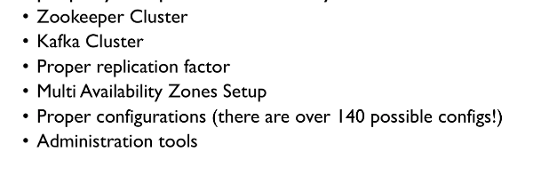
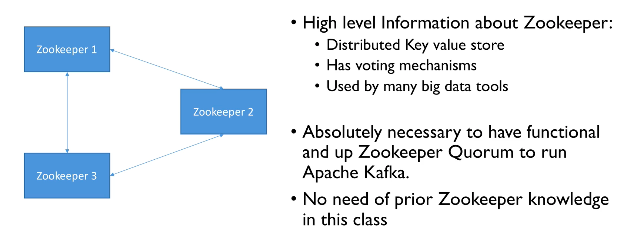
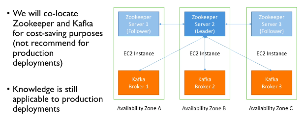
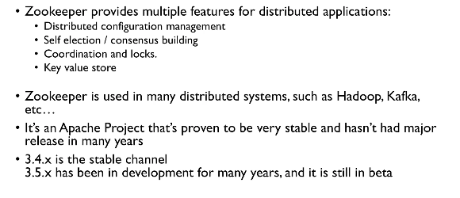

## Install kafka on a standalone server  with zookeeper

### setup jdk 11 

```
sudo amazon-linux-extras install java-openjdk11
```

### lets check it 

```
[root@ip-172-31-13-141 ~]# java -version 
openjdk version "11.0.16" 2022-07-19 LTS
OpenJDK Runtime Environment (Red_Hat-11.0.16.0.8-1.amzn2.0.1) (build 11.0.16+8-LTS)
OpenJDK 64-Bit Server VM (Red_Hat-11.0.16.0.8-1.amzn2.0.1) (build 11.0.16+8-LTS, mixed mode, sharing)
[root@ip-172-31-13-141 ~]# 
```

### download kafka 3.x binary then setup in a path variable 

```
 wget https://downloads.apache.org/kafka/3.3.1/kafka_2.13-3.3.1.tgz
  tar xvzf kafka_2.13-3.3.1.tgz 
```
### start zookeeper -- Note you can create systemd-unit file 

```
zookeeper-server-start.sh  /opt/kafka_2.13-3.3.1/config/zookeeper.properties
```

### Now start kafka single cluster or create systemd file 

```
[root@ip-172-31-13-141 kafka_2.13-3.3.1]# kafka-server-start.sh  /opt/kafka_2.13-3.3.1/config/server.properties
```

### KAFKA without zookeeper 

```
[root@ip-172-31-13-141 kafka_2.13-3.3.1]# kafka-storage.sh  random-uuid
XsIWkIEkShG1ymikn-JI0g


```

### then 

```
[root@ip-172-31-13-141 kafka_2.13-3.3.1]# kafka-storage.sh  format -t XsIWkIEkShG1ymikn-JI0g -c config/kraft/server.properties 
Formatting /tmp/kraft-combined-logs with metadata.version 3.3-IV3.
```

# Kafka Cluster 

### with Zookeeper -- we need



### Zookeeper QuoRUm architecture 



### Kafka architecture 




## Zookeeper info 

### Concept 


===


