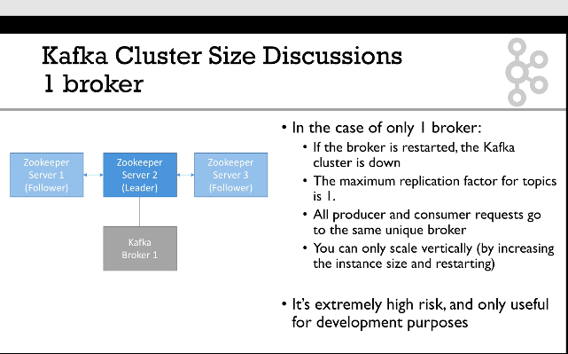
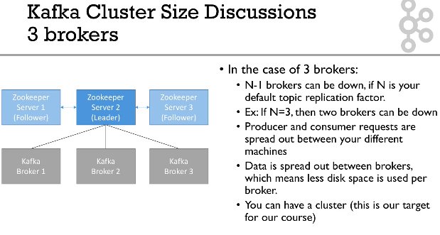

## setup multinode cluster 

## steps 

## Node 1 

### Setting up zookeeper 

#### Install jdk 11 

```
sudo amazon-linux-extras install java-openjdk11

---
[root@ip-172-31-13-141 ~]# java --version 
openjdk 11.0.16 2022-07-19 LTS
OpenJDK Runtime Environment (Red_Hat-11.0.16.0.8-1.amzn2.0.1) (build 11.0.16+8-LTS)
OpenJDK 64-Bit Server VM (

```

### Disable swap memory 

```
 echo "vm.swappiness = 0"  >>/etc/sysctl.conf
```

### Downlaod kafka from apache.kafka.org 

```
cd /opt
 wget https://downloads.apache.org/kafka/3.3.1/kafka_2.13-3.3.1.tgz
```

### note: this bundle has zookeeper and kafka both 

### setup zookeeper 

```

tar xvzf kafka_2.13-3.3.1.tgz

```

### verify 

```
[root@ip-172-31-13-141 ~]# cd /opt/
[root@ip-172-31-13-141 opt]# ls
aws  kafka_2.13-3.3.1  rh
[root@ip-172-31-13-141 opt]# ls kafka_2.13-3.3.1/
LICENSE  NOTICE  bin  config  libs  licenses  logs  site-docs
[root@ip-172-31-13-141 opt]# 


```

### setting path 

```
[root@ip-172-31-13-141 opt]# cat /root/.bashrc 
# .bashrc

# User specific aliases and functions

alias rm='rm -i'
alias cp='cp -i'
alias mv='mv -i'

# Source global definitions
if [ -f /etc/bashrc ]; then
	. /etc/bashrc
fi

KAFKA_HOME=/opt/kafka_2.13-3.3.1
PATH=$PATH:$KAFKA_HOME/bin
export PATH
```

### lets configure zookeeper 

```
[root@ip-172-31-13-141 opt]# cd /opt/kafka_2.13-3.3.1/
[root@ip-172-31-13-141 kafka_2.13-3.3.1]# ls
LICENSE  NOTICE  bin  config  libs  licenses  logs  site-docs
[root@ip-172-31-13-141 kafka_2.13-3.3.1]# cd config/
[root@ip-172-31-13-141 config]# ls
connect-console-sink.properties    connect-file-source.properties   consumer.properties  server.properties
connect-console-source.properties  connect-log4j.properties         kraft                tools-log4j.properties
connect-distributed.properties     connect-mirror-maker.properties  log4j.properties     trogdor.conf
connect-file-sink.properties       connect-standalone.properties    producer.properties  zookeeper.properties


==== changing in zookeeper.properties 

dataDir=/var/lib/zookeeper
# the port at which the clients will connect
clientPort=2181
# disable the per-ip limit on the number of connections since this is a non-production config
maxClientCnxns=0

```

### lets start zookeeper 

```
[root@ip-172-31-13-141 ~]# zookeeper-server-start.sh   -daemon  /opt/kafka_2.13-3.3.1/config/zookeeper.properties 
[root@ip-172-31-13-141 ~]# 
[root@ip-172-31-13-141 ~]# netstat -nlpt
Active Internet connections (only servers)
Proto Recv-Q Send-Q Local Address           Foreign Address         State       PID/Program name    
tcp        0      0 0.0.0.0:111             0.0.0.0:*               LISTEN      2655/rpcbind        
tcp        0      0 0.0.0.0:22              0.0.0.0:*               LISTEN      3152/sshd           
tcp        0      0 127.0.0.1:25            0.0.0.0:*               LISTEN      3091/master         
tcp6       0      0 :::2181                 :::*                    LISTEN      15578/java 
```

### lets connection to zookeeper and check its file-system 

```
[root@ip-172-31-13-141 ~]# zookeeper-shell.sh   127.0.0.1:2181
Connecting to 127.0.0.1:2181
Welcome to ZooKeeper!
JLine support is disabled

WATCHER::

WatchedEvent state:SyncConnected type:None path:null

ls /
[zookeeper]

```

### another way of connecting 

```
[root@ip-172-31-13-141 ~]# echo "ruok"  |  nc 127.0.0.1  2181 ; echo 
ruok is not executed because it is not in the whitelist.


```

### so lets enable 4 word letter commands 

```
[root@ip-172-31-13-141 ~]# cat /opt/kafka_2.13-3.3.1/config/zookeeper.properties
4lw.commands.whitelist=*

---
zookeeper-server-stop.sh
zookeeper-server-start.sh   -daemon  /opt/kafka_2.13-3.3.1/config/zookeeper.properties
```

### lets test it 

```
[root@ip-172-31-13-141 ~]# echo "ruok"  |  nc 127.0.0.1  2181 ; echo 
imok
[root@ip-172-31-13-141 ~]# echo "stat"  |  nc 127.0.0.1  2181 ; echo 
Zookeeper version: 3.6.3--6401e4ad2087061bc6b9f80dec2d69f2e3c8660a, built on 04/08/2021 16:35 GMT
Clients:
 /127.0.0.1:35102[0](queued=0,recved=1,sent=0)

Latency min/avg/max: 0/0.0/0
Received: 5
Sent: 4
Connections: 1
Outstanding: 0
Zxid: 0x2
Mode: standalone
Node count: 5

```

### now changing configure for multi node 

```
tickTime=2000
# number of ticks that initial sync can take while starting zookeeper 
initLimit=10
# sending request and getting ack 
syncLimit=5
# admin.serverPort=8080
server.1=ip-172-31-13-141.ap-south-1.compute.internal:2888:3888
server.2=ip-172-31-8-169.ap-south-1.compute.internal:2888:3888
server.3=ip-172-31-1-166.ap-south-1.compute.internal:2888:3888

```

## Note: all the nodes will have same configuration as given above 

# apache kafka cluster setup 

###  cluster size discussion 

### case 1 



### case 2 



### kafka configuration 

```
############################# Server Basics #############################

# The id of the broker. This must be set to a unique integer for each broker.
broker.id=1
# change your.host.name by your machine's IP or hostname
advertised.listeners=PLAINTEXT://kafka1:9092

# Switch to enable topic deletion or not, default value is false
delete.topic.enable=true

############################# Log Basics #############################

# A comma seperated list of directories under which to store log files
log.dirs=/data/kafka

# The default number of log partitions per topic. More partitions allow greater
# parallelism for consumption, but this will also result in more files across
# the brokers.
num.partitions=8
# we will have 3 brokers so the default replication factor should be 2 or 3
default.replication.factor=3
# number of ISR to have in order to minimize data loss
min.insync.replicas=2

############################# Log Retention Policy #############################

# The minimum age of a log file to be eligible for deletion due to age
# this will delete data after a week
log.retention.hours=168

# The maximum size of a log segment file. When this size is reached a new log segment will be created.
log.segment.bytes=1073741824

# The interval at which log segments are checked to see if they can be deleted according
# to the retention policies
log.retention.check.interval.ms=300000

############################# Zookeeper #############################

# Zookeeper connection string (see zookeeper docs for details).
# This is a comma separated host:port pairs, each corresponding to a zk
# server. e.g. "127.0.0.1:3000,127.0.0.1:3001,127.0.0.1:3002".
# You can also append an optional chroot string to the urls to specify the
# root directory for all kafka znodes.
zookeeper.connect=zookeeper1:2181,zookeeper2:2181,zookeeper3:2181/kafka

# Timeout in ms for connecting to zookeeper
zookeeper.connection.timeout.ms=6000


############################## Other ##################################
# I recommend you set this to false in production.
# We'll keep it as true for the course
auto.create.topics.enable=true

```

### start kafka server 

```
 kafka-server-start.sh -daemon  ./server.properties
```

### lets connect to kafka and create a topics 

```
kafka-topics.sh  --bootstrap-server localhost:9092 --create --topic ashu-logs --replication-factor 1 --partitions 3 
```

### lets read message 

```
[root@ip-172-31-13-141 ~]# kafka-console-consumer.sh  --bootstrap-server localhost:9092  --topic ashu-logs --from-beginning
hllo broker 1 how are you doing 

^CProcessed a total of 1 messages
[root@ip-172-31-13-141 ~]# 
```


