# Understanding 

### apache kafka 

<ol>
    <li>An open Source project for event store and stream processing platform </li>
    <li> created by LinkedIn in </li>
    <li> Written in Java & Scala </li>
    <li> horizentally scalable & can scale millions of message per second  </li>
    <li> latency in real time is less than 10 ms </li>
    
</ol>

### use cases 

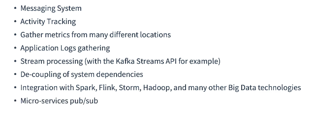

### use cases examples 

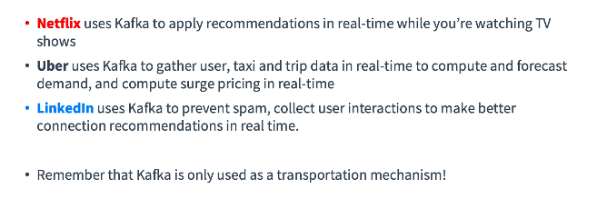

## lets understand kafa in an other way 

### problems with companies while sharing data 

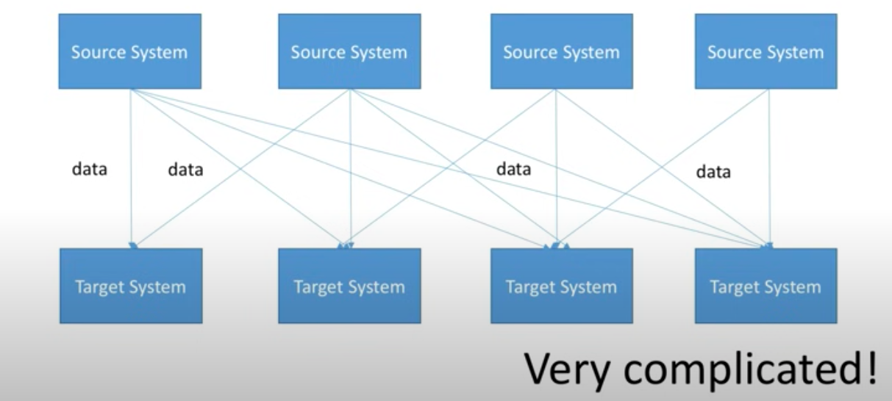

### understanding complexity again 

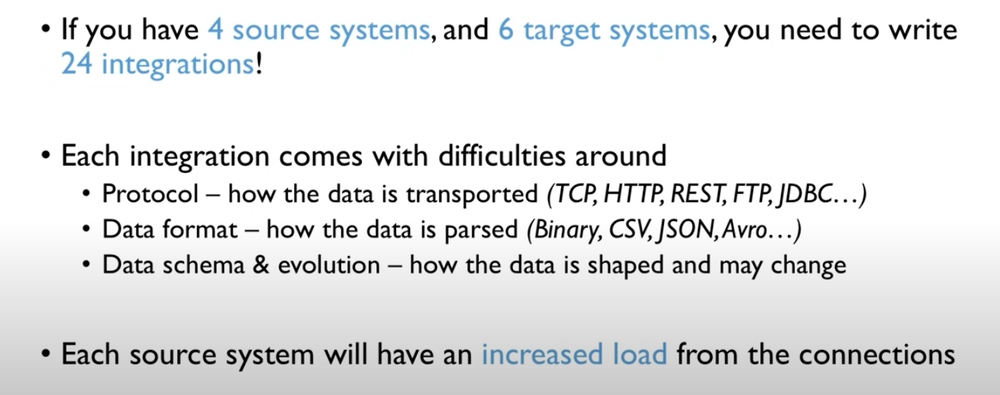

### SO need data decoupling stream & Systems 

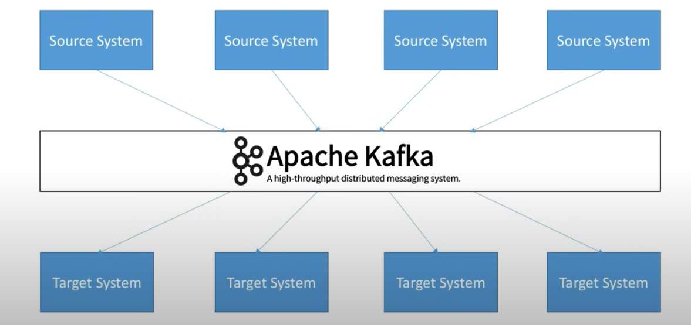

### Understading data sources and target system in example 

## Understanding core concepts 

### Kafka Topic 

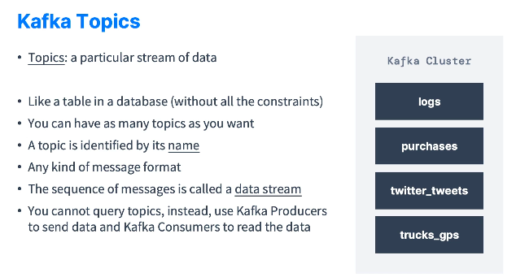

### Kafka partitions & offsets 

 Each kafka topics can have many partitions and each partitions gonna have order number called offsets 

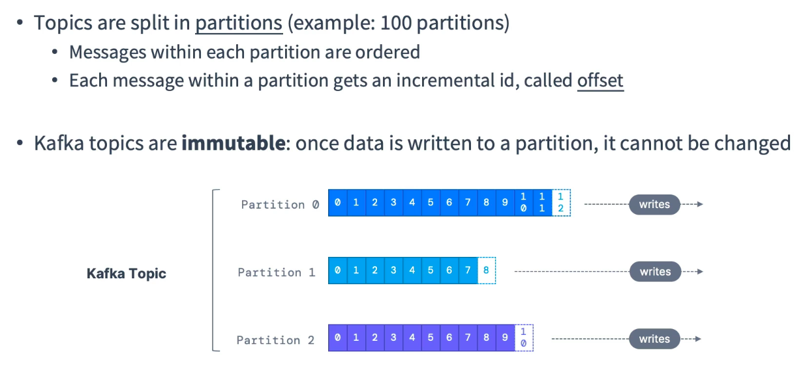

### Understanding using truck GPS system 

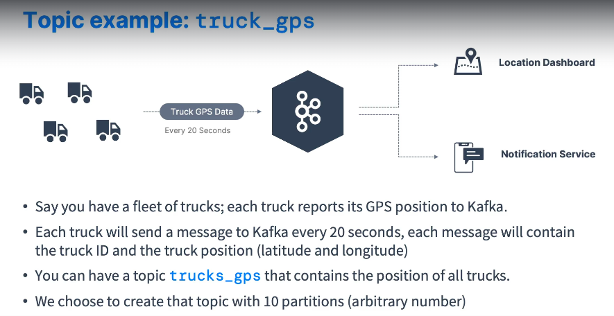

### partitions and offsets -- logic for timeout and reuse

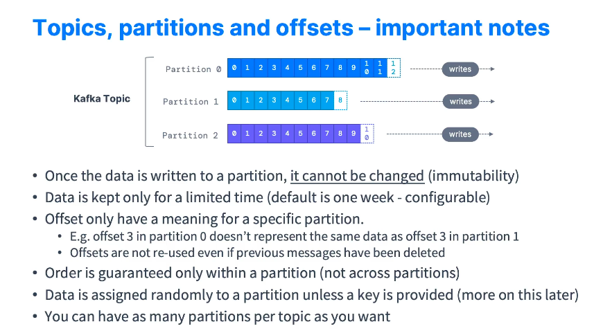

## Introduction to Producers 

 The One who sends data kafka broker , targeting a topic and its partitions 

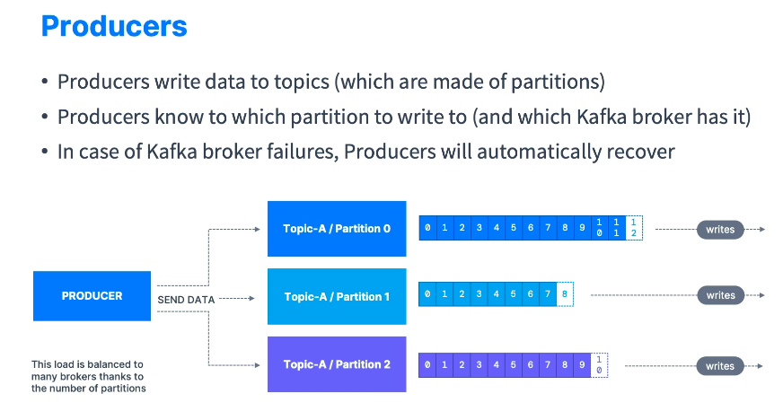

### Producer message concept for sending data to kafka broker 

 if kafka message is not having any fixed key in message , then it will send message to a topic's partition in round robin manner 

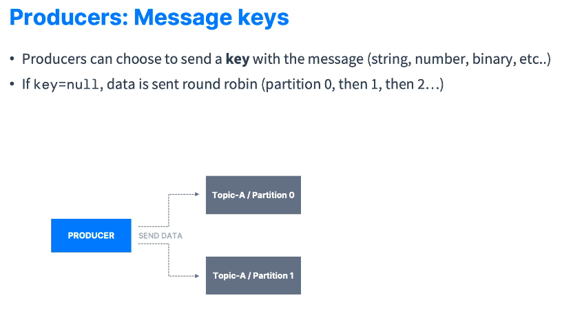

 but if producer message is gonna have some key , so the same key will send data to same partition of the topic 

### producer  message look like 

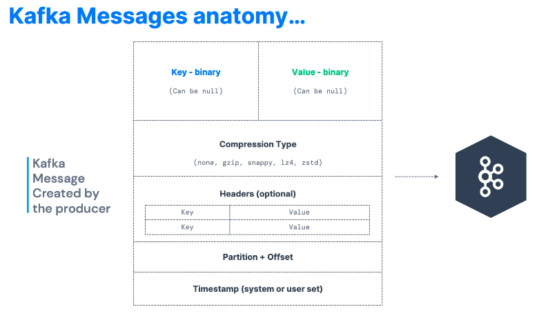

