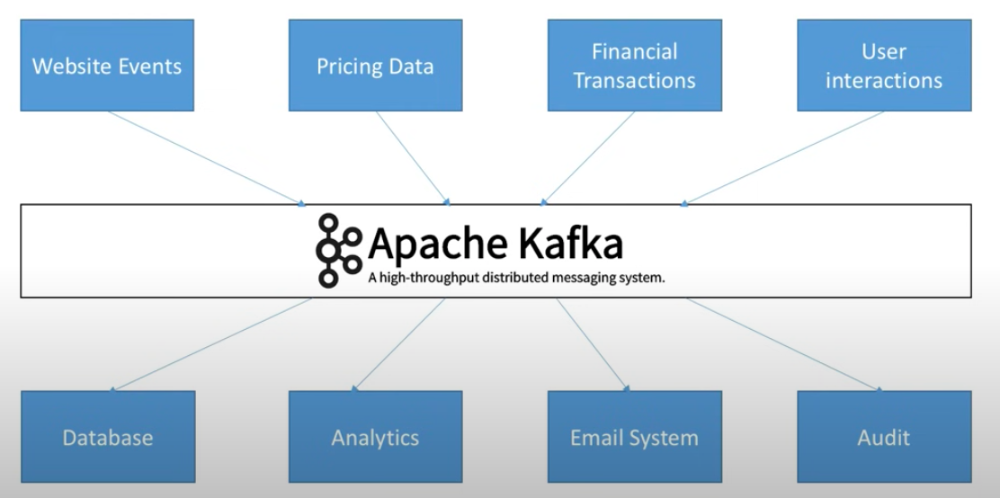
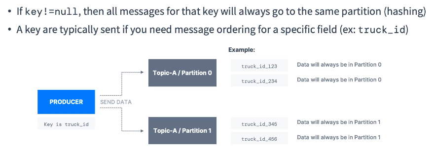

# Understanding 

### apache kafka 

<ol>
    <li>An open Source project for event store and stream processing platform </li>
    <li> created by LinkedIn in </li>
    <li> Written in Java & Scala </li>
    <li> horizentally scalable & can scale millions of message per second  </li>
    <li> latency in real time is less than 10 ms </li>
    
</ol>

### use cases 

### use cases examples 

## lets understand kafa in an other way 

### problems with companies while sharing data 

### understanding complexity again 

### SO need data decoupling stream & Systems 

### Understading data sources and target system in example 

## Understanding core concepts 

### Kafka Topic 

### Kafka partitions & offsets 

 Each kafka topics can have many partitions and each partitions gonna have order number called offsets 

### Understanding using truck GPS system 

### partitions and offsets -- logic for timeout and reuse

## Introduction to Producers 

 The One who sends data kafka broker , targeting a topic and its partitions 

### Producer message concept for sending data to kafka broker 

 if kafka message is not having any fixed key in message , then it will send message to a topic's partition in round robin manner 

 but if producer message is gonna have some key , so the same key will send data to same partition of the topic 

### producer  message look like 

### How Kafka Message gets accept ---> Using KAFKA Message SERIALIZER

 Kafka message get created by producers but Kafka server can't accept a general text message 

 So Kafka Message Serializer converting messages into bytes  

 Note: Kafka producers comes with common serializers like -- int , string ,float ,avro , protobuf and so on 

### how the message serializer works on producer side 

## Kafka COnsumers 

### Understanding 

THe one who reads messages from kafka topics --few more info is given below 

### Decoding message by consumer 

 Note: consumer has to know in advanced that message is having which data type of message for keys and values so that it can use that serializer to decode 

## KAFKA Broker / server 

 Kafka broker are those servers with in kafka cluster who receives message 

### some more info about kafka brokers 

### topic with broker 

### kafka broker discovery

 SO kafka client will connect to any one broker -- that is known as KAFKA Bootstrap server 

 that kafka bootstrap server after connected from client will send the list of all brokers 

### more info is given below 

### producer to -- partition 

### fetching details by consumers from a non leader partition broker

### consumer ack system 

# ROle of Zookeeper -- the Kafka broker manager till kafka version 2.x 

### some more info about zookeeper

### zookeeper with kafka brokers 

### do not use zookeeper from kafka client

### final zookeeper with kafka 

### kafka architecture with and without zookeeper 

