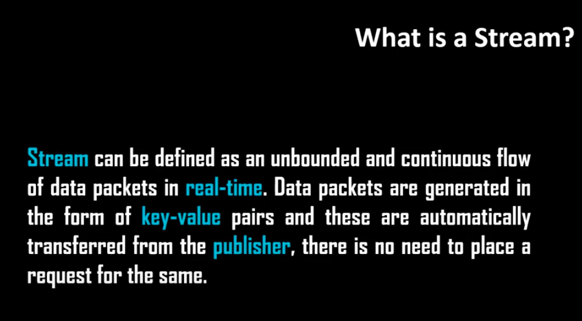
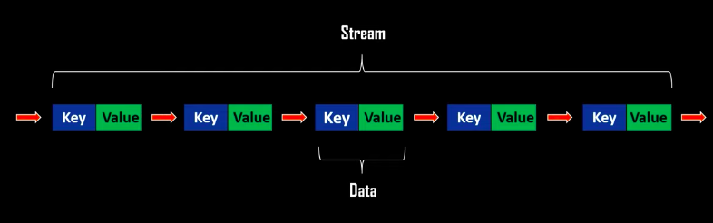
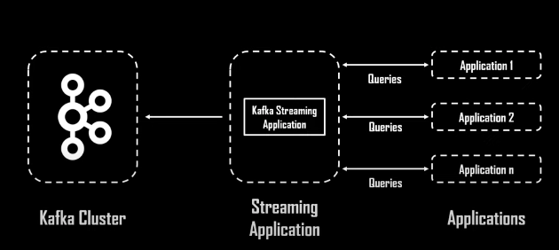

## introduction 

### Understanding stream 

### stream example 

### now kafka stream

 this is an API that integrates kafka cluster to data processing applications written in java/scala 

 this api leverage data processing capability of kafka 

## so apache kafka is 

### architecture of kafka stream 

 kafka stream uses internally kafka producer and consumer library 

