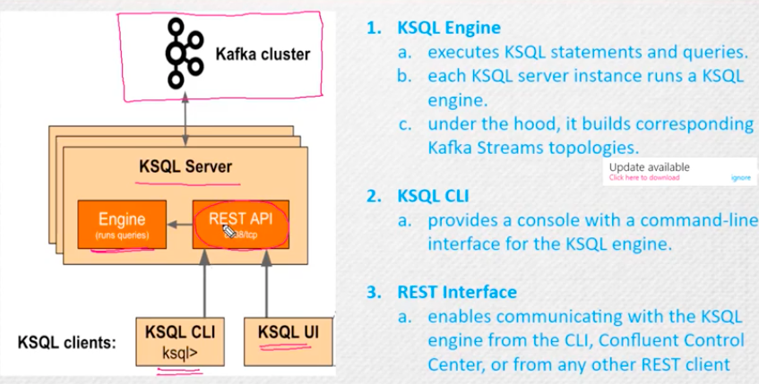

## introduction 

### Understanding stream 


### stream example 


### now kafka stream

<p> this is an API that integrates kafka cluster to data processing applications written in java/scala </p>
<p> this api leverage data processing capability of kafka </p>

## so apache kafka is 


### architecture of kafka stream 

<p> kafka stream uses internally kafka producer and consumer library </p>



### lets do a sample stream job in kafka

```
[root@control-plane ~]# kafka-topics.sh  --bootstrap-server localhost:9092  --list

[root@control-plane ~]# kafka-topics.sh  --bootstrap-server localhost:9092  --create --topic ashu-t1 --partitions 3 --replication-factor 1 
Created topic ashu-t1.
[root@control-plane ~]# kafka-topics.sh  --bootstrap-server localhost:9092  --list
ashu-t1
[root@control-plane ~]# kafka-topics.sh  --bootstrap-server localhost:9092  --create --topic streams-plaintext-input --partitions 3 --replication-factor 1 
Created topic streams-file-input.
[root@control-plane ~]# 
[root@control-plane ~]# kafka-topics.sh  --bootstrap-server localhost:9092  --create --topic streams-wordcount-output --partitions 3 --replication-factor 1 
Created topic streams-wordcount-output.
[root@control-plane ~]# kafka-topics.sh  --bootstrap-server localhost:9092  --list
ashu-t1
streams-file-input
streams-wordcount-output
[root@control-plane ~]# 

```

### lets read data in topic what we written 

```
[root@control-plane ~]# kafka-console-consumer.sh --bootstrap-server localhost:9092   --topic streams-plaintext-input  --from-beginning 
hey i am ashu
my name is ashu
i am ashu for kafka stream
```

## Now to check Streaming message live 

### step 1 terminal 1 

```
kafka-run-class.sh org.apache.kafka.streams.examples.wordcount.WordCountDemo
```
### in terminal 2 

```
./bin/kafka-console-consumer --bootstrap-server localhost:9092 \
        --topic streams-wordcount-output \
        --from-beginning \
        --formatter kafka.tools.DefaultMessageFormatter \
        --property print.key=true \
        --property key.deserializer=org.apache.kafka.common.serialization.StringDeserializer \
        --property value.deserializer=org.apache.kafka.common.serialization.LongDeserializer
```

### in terminal 3  starting sending data 

```
kafka-console-producer.sh --bootstrap-server localhost:9092 --topic streams-plaintext-input
```


### kafka more extended topic


### kafka connect 


### schema registy 


## Introduction to Kafka KSQLDB 

### kafka is not a 


### Note: if kafka is storing message then consumer is getting that message process that data with the help of streaming platform like 
<p>apache spark , flink , storm </p>

### Lets understanding kafka streaming 

<p> its a client library which read data from One topic and write back to another topic </p>


### problem with kafka stream 


# Note: Now problem with kafka stream is -- we have to write so huge amount of code in java to achieve streaming features

### Introducing kafka SQL -- KSQL is giving stream power without writing java code -- so we can write SQL queries 


### ksql architecture 


