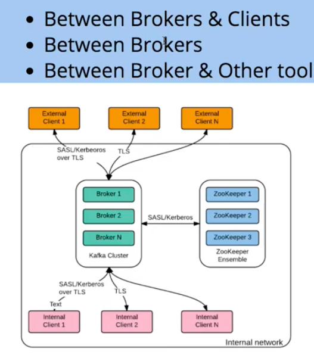
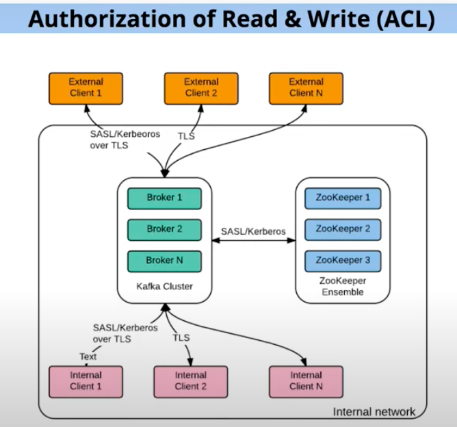
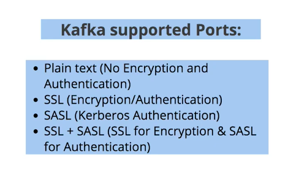
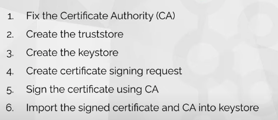

## Kafka security 

### all plain text communication is needs to security with KerbereOS / SSL 



### in publically used clusters all users can do write and read in a same topic to restrict these users we have ACL 



### kafka support for security 




## Security communication rules 

### if you have your own CA then are the steps to perform 




### zookeeper server -- client 

### create ca & zookeeper server cert 

```
𝟏. 𝐆𝐞𝐧𝐞𝐫𝐚𝐭𝐞 𝐂𝐀 == openssl req -new -x509 -keyout ca-key -out ca-cert -days 3650
𝟐. 𝐂𝐫𝐞𝐚𝐭𝐞 𝐓𝐫𝐮𝐬𝐭𝐬𝐭𝐨𝐫𝐞 == keytool -keystore kafka.zookeeper.truststore.jks -alias ca-cert -import -file ca-cert
𝟑. 𝐂𝐫𝐞𝐚𝐭𝐞 𝐊𝐞𝐲𝐬𝐭𝐨𝐫𝐞 == keytool -keystore kafka.zookeeper.keystore.jks -alias zookeeper -validity 3650 -genkey -keyalg RSA -ext SAN=dns:localhost
𝟒. 𝐂𝐫𝐞𝐚𝐭𝐞 𝐜𝐞𝐫𝐭𝐢𝐟𝐢𝐜𝐚𝐭𝐞 𝐬𝐢𝐠𝐧𝐢𝐧𝐠 𝐫𝐞𝐪𝐮𝐞𝐬𝐭 (𝐂𝐒𝐑) == keytool -keystore kafka.zookeeper.keystore.jks -alias zookeeper -certreq -file ca-request-zookeeper
𝟓. 𝐒𝐢𝐠𝐧 𝐭𝐡𝐞 𝐂𝐒𝐑 == openssl x509 -req -CA ca-cert -CAkey ca-key -in ca-request-zookeeper -out ca-signed-zookeeper -days 3650 -CAcreateserial
𝟔. 𝐈𝐦𝐩𝐨𝐫𝐭 𝐭𝐡𝐞 𝐂𝐀 𝐢𝐧𝐭𝐨 𝐊𝐞𝐲𝐬𝐭𝐨𝐫𝐞 == keytool -keystore kafka.zookeeper.keystore.jks -alias ca-cert -import -file ca-cert
𝟕. 𝐈𝐦𝐩𝐨𝐫𝐭 𝐭𝐡𝐞 𝐬𝐢𝐠𝐧𝐞𝐝 𝐜𝐞𝐫𝐭𝐢𝐟𝐢𝐜𝐚𝐭𝐞 𝐢𝐧𝐭𝐨 𝐊𝐞𝐲𝐬𝐭𝐨𝐫𝐞 == keytool -keystore kafka.zookeeper.keystore.jks -alias zookeeper -import -file ca-signed-zookeeper

```

### zookeeper server SSL conf 

```
dataDir=/tmp/zookeeper
# the port at which the clients will connect
clientPort=2181
secureClientPort=2182
authProvider.x509=org.apache.zookeeper.server.auth.X509AuthenticationProvider
serverCnxnFactory=org.apache.zookeeper.server.NettyServerCnxnFactory
ssl.trustStore.location=/opt/kafka_2.13-3.3.1/ssl-certs/zookeeper/kafka.zookeeper.truststore.jks
ssl.trustStore.password=Redhat
ssl.keyStore.location=/opt/kafka_2.13-3.3.1/ssl-certs/zookeeper/kafka.zookeeper.keystore.jks
ssl.keyStore.password=Redhat
# none , need 
ssl.clientAuth=need
```

### zookeeper SSL client --

## create file ssl.properties 

```
zookeeper.connect=localhost:2182
zookeeper.clientCnxnSocket=org.apache.zookeeper.ClientCnxnSocketNetty
zookeeper.ssl.client.enable=true
zookeeper.ssl.protocol=TLSv1.2
zookeeper.ssl.truststore.location=kafka.zoo-client.truststore.jks
zookeeper.ssl.truststore.password=Redhat
zookeeper.ssl.keystore.location=kafka.zoo-client.keystore.jks
zookeeper.ssl.keystore.password=Redhat
zookeeper.set.acl=true
```

### kafka server configuration with SSL 

```
listeners=SSL://localhost:9093

# Listener name, hostname and port the broker will advertise to clients.
# If not set, it uses the value for "listeners".
advertised.listeners=SSL://localhost:9093,PLAINTEXT://localhost:9092

ssl.truststore.location=/opt/kafka_2.13-3.3.1/ssl-certs/broker/kafka.broker.truststore.jks
ssl.truststore.password=Redhat
ssl.keystore.location=/opt/kafka_2.13-3.3.1/ssl-certs/broker/kafka.broker.keystore.jks
ssl.keystore.password=Redhat
ssl.key.password=Redhat
security.inter.broker.protocol=SSL
ssl.client.auth=required
ssl.protocol=TLSv1.2
```

### producer and consumer shell client setting 

```
bootstrap.servers=localhost:9092
security.protocol=SSL
ssl.truststore.location=kafka.producer.truststore.jks
ssl.truststore.password=12345
ssl.keystore.location=kafka.producer.keystore.jks
ssl.keystore.password=12345
ssl.key.password=12345
ssl.protocol=TLSv1.2
```

